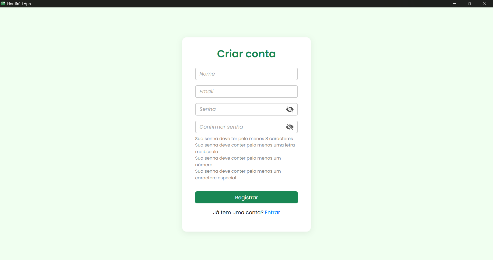

# Hortifruti App

Aplicativo desktop para gerenciamento de produtos de hortifruti, desenvolvido com **Electron**, **React** e **Node.js**.  
O sistema permite cadastrar, editar, excluir e visualizar produtos de forma prática e rápida.

## Funcionalidades

- Cadastro de produtos com nome, categoria, preço e estoque
- Listagem de produtos em tabela
- Edição e exclusão com confirmação
- Interface responsiva e intuitiva

## Tecnologias Utilizadas

### **Frontend**

- React
- Vite
- Bootstrap 5 / React Bootstrap
- Styled Components
- Axios

### **Backend**

- Node.js
- Express
- Prisma + SQLite
- Zod (validações)
- Passport.js (autenticação)
- Express-Session

### **Desktop**

- Electron

---

## Imagens

### **Tela de Login/Cadastro**


<hr/>


### **Tela de Categorias**


### **Tela de Dashboard**


<hr >


### **Tela de Produtos**


<hr/>


### **Tela de Criar/Editar Produto**


<hr/>


### **Tela de Relatórios**


### **Tela de Perfil**


---

## Estrutura do Projeto

```bash
hortifruti-app
├── backend/   # API com Node.js, Express e Prisma
└── frontend/  # Interface com React/Electron

## Como Rodar o Projeto

# Clone o repositório
git clone https://github.com/Filipe-Mamed/hortifruti-app.git

cd backend # Entre na pasta backend
npm install # Instale as dependências do backend
npm run dev # Inicie o servidor backend

cd frontend # Entre na pasta frontend
npm install # Instale as dependências do frontend
npm run dev # Inicie o servidor frontend


```

## LICENÇA

Este projeto está licenciado sob a Licença MIT. Veja o arquivo [LICENSE](LICENSE) para mais detalhes.
